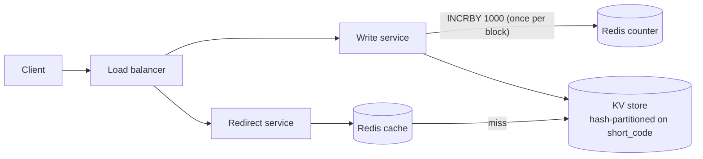

# URL Shortener

A small URL shortener service built in TypeScript with Fastify and Zod. It turns a long URL into a 7-character code and redirects that code back to the original URL. A React + TypeScript UI served at `/` lets a user create short links in a browser.

## Run it

Requires Node 18+.

```bash
npm install
npm run build:web  # builds the React UI into web/dist
npm run dev        # http://localhost:3000  (PORT and BASE_URL env vars override)
npm test           # 26 tests: unit, API (app.inject), UI (React Testing Library + jsdom)
npm run typecheck  # server and web
```

Fastify serves the built UI: `GET /` returns `web/dist/index.html` and bundles are served under `/assets/`, so neither collides with `GET /:short_code`. If the UI has not been built, `/` falls back to a minimal vanilla HTML form, so the API works without a build step.

For UI development, `npx vite --config web/vite.config.ts` runs the Vite dev server with `/urls` proxied to `:3000`.

## UI

- Form for the long URL, an optional custom alias, and an optional expiry (`datetime-local`, sent as ISO-8601 UTC). Empty optional fields are omitted from the request.
- On 201 the short URL is shown as a link; on 4xx the server's error message is shown.
- **Retry:** if the request fails at the network level (`fetch` rejects), the UI retries twice with 200 ms then 400 ms backoff before showing "Network error, please retry". HTTP errors (4xx and 5xx) are never retried: `POST /urls` is not idempotent, so a retry could create a duplicate link.

## API

### `POST /urls`

```json
{ "long_url": "https://example.com/a/long/path",
  "custom_alias": "mysale1",
  "expires_at": "2026-12-31T00:00:00Z" }
```

`custom_alias` and `expires_at` are optional.

| Status | Meaning |
|---|---|
| 201 | `{ short_url, short_code, expires_at }` (`expires_at` is `null` when omitted) |
| 400 | Invalid or non-http(s) URL, invalid alias, or `expires_at` in the past (`{ error, issues }`) |
| 409 | Alias already taken |

Alias rules: base62 characters only, 3–16 long, never exactly 7 characters (that length is reserved for generated codes), and not the reserved word `urls`.

### `GET /:short_code`

| Status | Meaning |
|---|---|
| 302 | Redirect, `Location` = the long URL |
| 404 | Unknown code |
| 410 | Code has expired |

A 302 (not 301) is used so browsers do not cache the redirect permanently, which keeps expiry enforceable.

## How codes are generated

Each app instance has a counter starting at 1. The next ID is encoded in base62 (`0-9a-zA-Z`) and left-padded to 7 characters, e.g. `1 → 0000001`. Seven base62 characters give ~3.5 trillion codes.

Because every ID is unique, codes are unique by construction: no hashing, no collision retries. The insert is still put-if-absent, so a counter reset fails loudly with a 500 instead of silently overwriting a link.

## Design (production shape)



This repo implements the write and redirect logic in one process with an in-memory store. In production:

- **Counter:** a durable Redis `INCRBY` (AOF on) or ticket table hands each server a block of 1,000 IDs, so the counter is off the hot path.
- **Storage:** a KV store (DynamoDB/Cassandra) partitioned by a hash of `short_code` using consistent hashing. Sequential IDs would create a hot shard under range partitioning; hashing spreads them evenly, and adding a node moves only ~1/N of keys.
- **Reads:** reads are ~100× writes, so a Redis LRU cache (~10 GB covers the hot 20%) fronts the store, with cache TTL capped at the link's remaining lifetime.
- **Expiry:** checked on read (410) and cleaned up by the store's native TTL.

Assumed scale: 100M new URLs/day (~1.2k writes/s), 100:1 read/write (~120k reads/s), ~90 TB over 5 years.

## Assumptions

- No time limit was given; the exercise was run as a 60-minute interview.
- Scale numbers above are assumed, not given.
- Submitting the same long URL twice yields two different codes (no dedupe).
- `expires_at` must be an ISO-8601 UTC timestamp (`Z` suffix).
- Uppercase `URLS` is allowed as an alias: routes are case-sensitive, so it cannot collide with `/urls`.

## Scope

Cut deliberately to fit the time box:

- Click analytics and user accounts/auth (and so no delete/update endpoints — without auth nobody can prove ownership).
- Non-sequential codes: generated codes are predictable. A Feistel shuffle or Sqids over the ID would fix this without changing the design.
- Distributed counter, cache and persistent store: described above, not built.

## Known limitations

- **Open redirect by design:** any http(s) target is accepted; there is no malware/safe-browsing check.
- **No rate limiting** on `POST /urls`, and no length cap on `long_url` beyond Fastify's 1 MB body limit.
- **Expired aliases are never freed:** reusing one returns 409, and expired records are never evicted from memory.
- **In-memory only:** all links are lost on restart.
- Past 62^7 IDs, generated codes exceed 7 characters and could collide with custom aliases (returning 500).
- `expires_at` with a timezone offset (e.g. `+02:00`) is rejected with 400; the UI always sends UTC.
- UI tests run in jsdom with `fetch` mocked; there is no real-browser end-to-end test.
- Rebuilding the UI while the server runs requires a server restart (assets are registered at startup).
- The no-build vanilla fallback UI (`src/ui.ts`) is untested; UI tests cover the React build.
- UI tests do not assert the retry backoff timing or the no-retry-on-5xx rule.
- A network-level retry can still duplicate a link if the first request reached the server but the response was lost. An idempotency key on `POST /urls` would close this.
